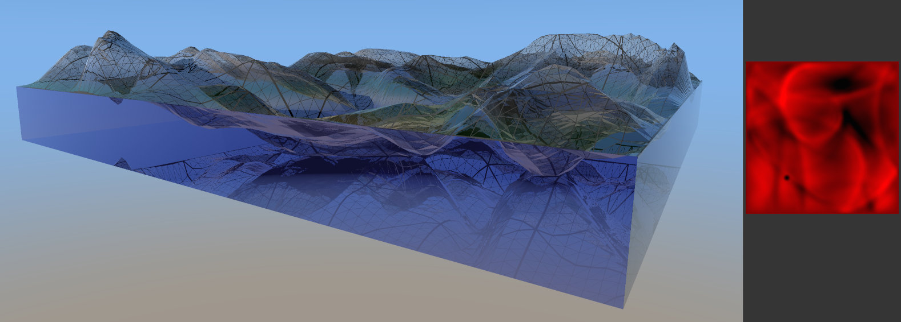

# vk_raytrace_displacement

This sample demonstrates the use of the
[`heightmap_rtx`](https://github.com/NVIDIAGameWorks/heightmap_rtx) library to
raytrace dynamically displaced geometry. `heightmap_rtx` is a small Vulkan
library to displace raytraced triangles with a heightmap. It uses [NVIDIA
Micro-Mesh](https://developer.nvidia.com/rtx/ray-tracing/micro-mesh)
([Toolkit](https://github.com/NVIDIAGameWorks/Displacement-MicroMap-Toolkit))
internally.

A notable feature of this sample is animation. A single and static
`VkCommandBuffer` that `heightmap_rtx` populates is resubmitted each frame
before building the acceleration structure. This allows convenient animation
without any mid-frame resource allocation for building the Micro-Map.

## Requirements

[`heightmap_rtx`](https://github.com/NVIDIAGameWorks/heightmap_rtx) is a
submodule. Run `git submodule update --init --recursive`.

Along with other nvpro samples, `nvpro_core` and the `VulkanSDK` are required to
build this project. Cmake will look in the parent directory for nvpro_core and
the VulkanSDK is typically found via environment variables.

[VK_NV_displacement_micromap](https://registry.khronos.org/vulkan/specs/1.3-extensions/man/html/VK_NV_displacement_micromap.html)
is required. See [device
support](https://vulkan.gpuinfo.org/listdevicescoverage.php?extension=VK_NV_displacement_micromap&platform=all).

> [!IMPORTANT]
> `VK_NV_displacement_micromap` likely requires recent NVIDIA [vulkan beta
> drivers](https://developer.nvidia.com/vulkan-driver) (>= 537.96) and
> [VulkanSDK](https://vulkan.lunarg.com/) (>= 1.3.268.0), particularly for GLSL
> `NV_displacement_micromap` support.

## Motivation

To render displacement with rasterization, one might use a tessellation shader,
mesh shader or trace the heightmap in a frament shader with parallax mapping. In
constrast, the vulkan raytracing API would normally only take regular triangle
geometry. A base mesh would need to be tessellated and displaced before building
the acceleration structure. This limitation is noted by [^1], in which heightmap
displacement traced directly using min-max mipmap acceleration similarly to [^2]
and [^3]. An alternative to tessellating geometry is NVIDIA Micro-Mesh. This GPU
feature offers a way to apply displacement without tessellating in the
application code. The vulkan raytracing acceleration structure build step is
also faster when using Micro-Mesh. However, building the Micro-Map that holds
the displacement is not trivial to code. The `heightmap_rtx` library simplifies
that step, taking just a `VkImage` displacement image and converting it before
the acceleration structure build.

## Limitations

There are a number of limitations of `heightmap_rtx` when used for displacement.
Please see the README in its repository for details. A significant one with
regard to correctness is that direction vectors are not normalized after
interpolation. This means displacement near high base mesh curvature will
produce quite different results.

The
`VkAccelerationStructureTrianglesDisplacementMicromapNV::displacementVectorFormat`
value must be fp16 (`VK_FORMAT_R16G16B16A16_SFLOAT`), which is one surprising
step. It would be more convenient to use normals directly with fp32
(`VK_FORMAT_R32G32B32_SFLOAT`).

[^1]: Theo Thonat, Francois Beaune, Xin Sun, Nathan Carr, and Tamy Boubekeur.
    2021. Tessellation-free displacement mapping for ray tracing. ACM Trans.
    Graph. 40, 6, Article 282 (December 2021) 
[^2]: Kyoungsu Oh, Hyunwoo Ki, and Cheol-Hi Lee. 2006. Pyramidal displacement
    mapping: a GPU based artifacts-free ray tracing through an image pyramid. In
    Proceedings of the ACM symposium on Virtual reality software and technology
    (VRST '06) 
[^3]: Art Tevs, Ivo Ihrke, and Hans-Peter Seidel. 2008. Maximum mipmaps for
    fast, accurate, and scalable dynamic height field rendering. In Proceedings
    of the 2008 symposium on Interactive 3D graphics and games (I3D '08) 